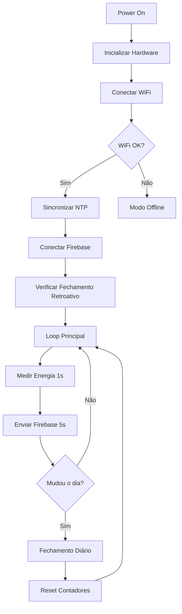

# 📟 PowerKeeper IoT - ESP32 Energy Monitor

**Código de Monitoramento de Energia em Tempo Real**  
Desenvolvido por **Luiz Gustavo, Matteo e Nicolas**  
Ciência da Computação | Unifeob 2025.1 e 2025.2

---

## 📘 Visão Geral

Este módulo IoT é o **coração da coleta de dados** do sistema PowerKeeper. Implementado em um microcontrolador ESP32, ele realiza a medição contínua do consumo elétrico utilizando sensores de corrente SCT013, processa os dados localmente e os transmite em tempo real para o Firebase Realtime Database.

O sistema opera de forma autônoma, realizando leituras precisas a cada segundo, calculando consumo acumulado com precisão de microssegundos e executando fechamentos diários automáticos para análise histórica.

---

## ⚙️ Funcionalidades Principais

### 🔌 Monitoramento Elétrico
- **Medição de corrente RMS** via sensor SCT013 não-invasivo
- **Suporte a múltiplas tensões**: 127V, 220V ou modo desligado
- **Cálculo automático** de potência instantânea (W) e consumo acumulado (kWh)
- **Filtragem de ruído**: leituras abaixo de 0.16A são descartadas
- **Precisão temporal**: utiliza `micros()` para cálculos exatos de energia

### 📡 Comunicação em Nuvem
- **Firebase Realtime Database** como backend
- **Envio periódico** de leituras a cada 5 segundos
- **Estrutura de dados organizada**:
  - `/leituras/leitura_N` — log completo de todas as medições
  - `/ultima_leitura` — snapshot do estado atual
  - `/consumos_diarios/YYYY-MM-DD` — fechamentos diários

### 🕐 Sincronização Temporal
- **NTP automático** com servidores `pool.ntp.org` e `time.nist.gov`
- **Fuso horário**: UTC-3 (Brasil/São Paulo)
- **Timestamps ISO 8601**: formato `YYYY-MM-DD HH:MM:SS`
- **Proteção contra datas inválidas**: aguarda sincronização antes de iniciar

### 📊 Fechamento Diário Inteligente
- **Detecção automática** de virada de dia (meia-noite)
- **Fechamento retroativo** ao ligar o dispositivo (evita perda de dados)
- **Prevenção de duplicatas** usando marcador `/ultimo_fechamento/data`
- **Reset de contadores** diários para novo ciclo de medição

### 🎛️ Interface Física
- **Botão de controle**: alterna entre 127V → 220V → OFF
- **Indicadores LED**:
  - LED verde (127V)
  - LED azul (220V)  
  - LED vermelho (OFF) — acende por 10 segundos ao desligar
- **Feedback serial**: logs detalhados via porta USB (115200 baud)

---

## 🧰 Hardware Necessário

| Componente | Especificação | Função |
|------------|---------------|--------|
| **Microcontrolador** | ESP32 DevKit | Processamento e conectividade WiFi |
| **Sensor de Corrente** | SCT013-030 (30A) | Medição não-invasiva de corrente AC |
| **Botão** | Push-button táctil | Seleção de modo de tensão |
| **LEDs** | 3x LEDs (verde/azul/vermelho) | Indicação visual de estado |
| **Resistores** | 3x 220Ω | Limitação de corrente dos LEDs |
| **Fonte de Alimentação** | 5V/1A (USB ou externa) | Alimentação do ESP32 |

### 📐 Pinagem

```cpp
PIN_SCT_SENSOR  = 35  // Entrada analógica do sensor SCT013
PIN_BUTTON      = 14  // Botão de controle (pull-up interno)
PIN_LED_220V    = 25  // LED azul (modo 220V)
PIN_LED_127V    = 26  // LED verde (modo 127V)
PIN_LED_OFF     = 27  // LED vermelho (modo OFF)
```

---

## 📦 Dependências de Software

### Bibliotecas Arduino/ESP32

```cpp
#include <WiFi.h>                    // Conectividade WiFi nativa do ESP32
#include "EmonLib.h"                 // Biblioteca para medição de energia
#include <Firebase_ESP_Client.h>    // Cliente Firebase para ESP32
#include <time.h>                    // Funções de tempo POSIX
```

### Instalação via Arduino IDE

1. **EmonLib**: https://github.com/openenergymonitor/EmonLib
   ```
   Sketch → Incluir Biblioteca → Gerenciar Bibliotecas
   Buscar: "EmonLib" → Instalar
   ```

2. **Firebase ESP Client**: https://github.com/mobizt/Firebase-ESP-Client
   ```
   Buscar: "Firebase ESP Client" → Instalar versão 4.x ou superior
   ```

---

## 🚀 Configuração e Instalação

### 1️⃣ Configurar Credenciais WiFi

Edite as constantes no início do código:

```cpp
const char* WIFI_SSID = "SuaRedeWiFi";
const char* WIFI_PASSWORD = "SuaSenha";
```

### 2️⃣ Configurar Firebase

Crie um projeto no [Firebase Console](https://console.firebase.google.com/):

1. Criar novo projeto
2. Ativar **Realtime Database**
3. Ir em **Configurações do Projeto** → **Contas de Serviço**
4. Copiar o **Database URL** e **Database Secret**

Atualize no código:

```cpp
#define FIREBASE_HOST "https://seu-projeto.firebaseio.com/"
#define FIREBASE_AUTH "sua_chave_secreta_aqui"
```

### 3️⃣ Calibração do Sensor SCT013

O fator de calibração padrão é `1.45`. Para ajustar:

1. Conecte uma carga conhecida (ex: lâmpada 100W)
2. Meça a corrente real com um multímetro
3. Compare com a leitura do ESP32
4. Ajuste a constante:

```cpp
const float CURRENT_CALIBRATION = 1.45;  // Ajustar conforme necessário
```

### 4️⃣ Upload do Código

```bash
1. Abrir Arduino IDE
2. Selecionar placa: "ESP32 Dev Module"
3. Selecionar porta COM correta
4. Verificar/Compilar (Ctrl+R)
5. Upload (Ctrl+U)
```

### 5️⃣ Monitoramento Serial

Abrir Serial Monitor (115200 baud) para acompanhar:
- Conexão WiFi
- Sincronização NTP
- Leituras em tempo real
- Envios ao Firebase
- Fechamentos diários

---

## 📊 Estrutura de Dados no Firebase

### Leituras em Tempo Real
```json
{
  "leituras": {
    "leitura_1": {
      "tensao": 127,
      "corrente": 2.345,
      "potencia": 297.815,
      "consumoAtual_kWh": 0.123456,
      "idDispositivo": 1,
      "timestamp": "2025-02-13 14:30:00"
    },
    "leitura_2": { ... }
  }
}
```

### Snapshot Atual
```json
{
  "ultima_leitura": {
    "tensao": 127,
    "corrente": 2.345,
    "potencia": 297.815,
    "consumoAtual_kWh": 0.123456,
    "idDispositivo": 1,
    "timestamp": "2025-02-13 14:30:05"
  }
}
```

### Fechamentos Diários
```json
{
  "consumos_diarios": {
    "2025-02-12": {
      "consumo_kWh": 12.456,
      "idDispositivo": 1,
      "timestamp": "2025-02-13 00:00:01"
    },
    "2025-02-13": { ... }
  },
  "ultimo_fechamento": {
    "data": "2025-02-12"
  }
}
```

---

## 🔄 Fluxo de Operação



---

## 🐛 Solução de Problemas

### ❌ WiFi não conecta
- Verificar SSID e senha
- Confirmar que a rede é 2.4GHz (ESP32 não suporta 5GHz)
- Verificar alcance do sinal WiFi

### ❌ Leituras sempre em zero
- Verificar conexão do sensor SCT013 no pino 35
- Confirmar que o cabo está fechado corretamente ao redor do condutor
- Ajustar fator de calibração

### ❌ Timestamp em 1970
- Aguardar sincronização NTP (pode levar até 30 segundos)
- Verificar conexão com internet
- Tentar servidores NTP alternativos

### ❌ Dados não aparecem no Firebase
- Verificar Database URL e Auth Key
- Confirmar regras de segurança do Firebase (modo teste)
- Verificar logs no Serial Monitor

### ❌ Fechamento diário duplicado
- Sistema previne duplicatas automaticamente
- Verificar `/ultimo_fechamento/data` no Firebase
- Caso necessário, deletar entrada duplicada manualmente

---

## 📈 Melhorias Futuras

- [ ] Suporte a múltiplos sensores (monitoramento trifásico)
- [ ] Modo de economia de energia (deep sleep entre leituras)
- [ ] Interface web local (ESP32 como Access Point)
- [ ] Alertas de consumo anômalo via notificações push
- [ ] Armazenamento local em caso de falha de rede (SD Card)
- [ ] OTA (Over-The-Air) updates para firmware
- [ ] Integração com Google Sheets para backup
- [ ] Dashboard em tempo real usando Firebase Hosting

---

## 📝 Notas Técnicas

### Precisão de Medição
- **Resolução temporal**: 1 µs (função `micros()`)
- **Taxa de amostragem**: 2048 amostras por medição RMS
- **Intervalo de medição**: 1 segundo
- **Acumulação de energia**: fórmula `Wh = P × (Δt / 3.600.000.000)`

### Consumo de Memória
- **Flash**: ~320KB (código compilado)
- **RAM dinâmica**: ~45KB (variáveis + stack)
- **Heap disponível**: ~250KB para operações Firebase

### Limitações
- **Sensores suportados**: apenas SCT013 (split-core)
- **Monofásico**: uma fase por dispositivo
- **WiFi 2.4GHz**: não suporta redes 5GHz
- **Precisão**: ±2% (depende da calibração)

---

## 📄 Licença

Este código faz parte do projeto **PowerKeeper** desenvolvido como trabalho acadêmico no curso de Ciência da Computação da Unifeob (2025.1 e 2025.2).

---

## 👨‍💻 Desenvolvedores

- **Luiz Gustavo**
- **Matteo**
- **Nicolas**

**Grupo Synatec** | Ciência da Computação | Unifeob

---

## 🔗 Links Úteis

- [Repositório PowerKeeper](https://github.com/seu-repo/powerkeeper)
- [Documentação EmonLib](https://learn.openenergymonitor.org/electricity-monitoring/ctac/how-to-build-an-arduino-energy-monitor)
- [Firebase ESP Client Docs](https://github.com/mobizt/Firebase-ESP-Client)
- [ESP32 Datasheet](https://www.espressif.com/sites/default/files/documentation/esp32_datasheet_en.pdf)

---

**💡 Dica**: Para suporte ou dúvidas, consulte os logs do Serial Monitor em 115200 baud. O sistema fornece feedback detalhado de todas as operações.
